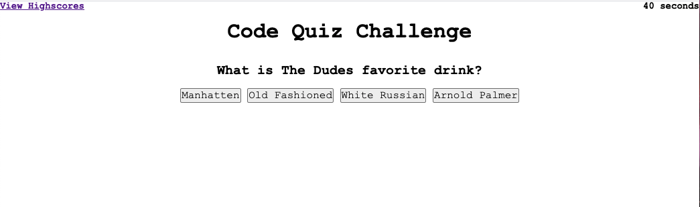

# Web APIs: Code Quiz

https://thompsonel11.github.io/JS_Quiz/
https://github.com/thompsonel11/JS_Quiz

## Assignment

The purpose of this assignment is to utilize JavaScript to create a quiz. I chose to create a quiz on the classic film "The Big Lebowski". 

## Start Page

My quiz begins by presenting a screen that displays: 
- the title 
- a link to "View Highscores"
- instructions that explain how the score is calculated 
- a "start quiz" button that triggers the timer and presents the user with the first question. 

## Begin Quiz

Once the user has clicked the start button, you will notice a countdown appears and begins counting down from 50. The user will begin answering questions.  With each question answered, the user will progress to the next question. With each incorrect answer, the clock is deducted 10 seconds.  The final time is the user's score. 

## Completed Quiz

Once the user has either run out of time, or completed all quiz questions, the user will be presented with an "All Done" message. He/she will also be presented with their score and prompted to enter his/her initials into a form. 

## View Highscores

Once the user enters their initials, they will click the "submit" button which will direct them to the "Highscores" page.  This page can also be accessed via the "View highscores" link in the top, left portion of the webpage. 

INSERT SCREENSHOT ONCE YOU GET LOCAL STOAGE WORKING

